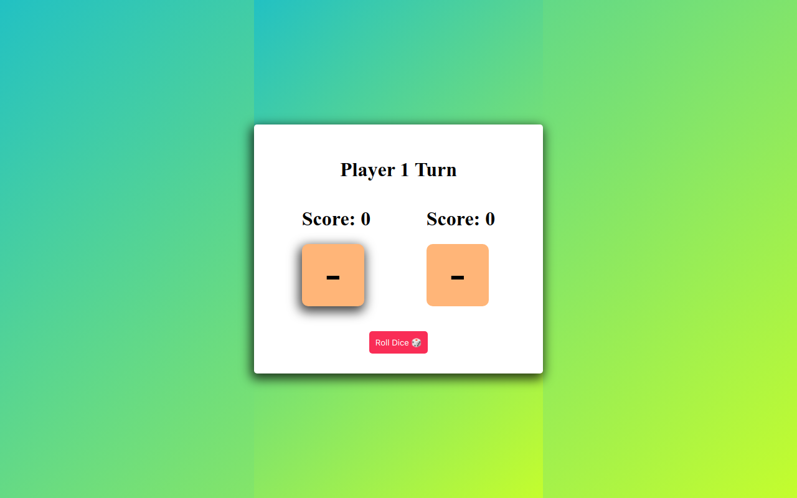

# Dice Game

## Overview

Welcome to the Dice Game project! This web application lets two players take turns rolling dice to accumulate scores. Built with HTML, CSS, and JavaScript, the project adds excitement with a simple gameplay mechanic.

### Table of Contents

- [Installation](#installation)
- [How to use](#how-to-use)
- [Technologies Used](#technologies-used)
- [Features](#features)
- [Project Structure](#project-structure)
- [Credits](#credits)
- [License](#license)



## Installation

To run this project locally, follow these steps:

1. Clone the repository to your local machine.
    ```bash
    git clone https://github.com/m-ramzan786/Dice-Game.git
    ```

2. Open the project folder in your code editor.

3. Open the `index.html` file in your web browser.

## How to Use

To use the Dice Game:

1. Open the [live demo](https://dice-game-teal-gamma.vercel.app/) or run it locally.

2. Click "Roll Dice" for Player 1 to start the game.

3. Alternately click "Roll Dice" for Player 2 on their turn.

4. The game ends when either player's score reaches 20 or more.

5. A popup window displays the winner's result.

6. Click "Reset Game" to start a new game.

## Technologies Used

- HTML
- CSS
- JavaScript

## Features

- **Roll Dice Buttons:** Each player has a dedicated "Roll Dice" button for their turn.

- **Winning Condition:** The game ends when either player's score reaches 20 or more.

- **Winner Popup:** A popup window displays the winner's result when the game concludes.

- **Reset Game Button:** Start a new game with the "Reset Game" button.

- **User-Friendly Interface:** Simple design for ease of use.

- **Responsive:** Responsive design for various screen sizes.

## Project Structure

The project is organized for easy navigation and features a clean and visually appealing design.

## Future Enhancements

- **Scoring History:** Add a feature to display the history of rolls and scores.

- **Customizable Winning Threshold:** Allow users to set their preferred winning score.

## Credits

- [Muhammad Ramzan](https://github.com/m-ramzan786) - Project Creator

## License

This project is licensed under the [MIT License](LICENSE). Feel free to use and modify the code as per the license terms.

## Badges


## How to Contribute

If you'd like to contribute to the project, follow these steps:

1. Fork the project.
2. Create a new branch for your feature: `git checkout -b feature-name`.
3. Commit your changes: `git commit -m 'Add new feature'`.
4. Push to the branch: `git push origin feature-name`.
5. Open a pull request.

## Contact

If you have any questions, suggestions, or just want to connect, feel free to reach out:

- Email: [mramzanstv@gmail.com](mramzanstv@gmail.com)
- Portfolio: [Muhammad-Ramzan-Portfolio](https://muhammad-ramzan.vercel.app/)
- LinkedIn: [in/m-ramzan786](https://www.linkedin.com/in/m-ramzan786/)

## Tests

The project includes a set of tests to ensure the functionality is working as expected. To run the tests, use the following command:
```bash
npm test
```

Roll the dice and may the best player win!
